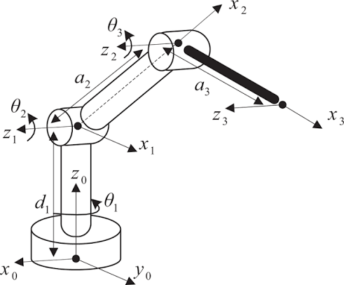
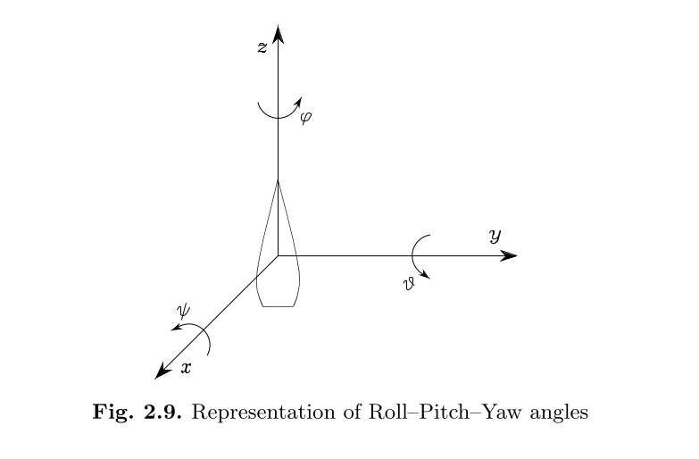

# Forward Kinematics: Robot 3DOF

Implementazione del modello cinematico per un manipolatore 3DOF.



## 1. Definizione dei Reference Frame
Il modello è stato implementato seguendo la convenzione di Denavit-Hartenberg (D-H) come illustrato nello schema del manipolatore. Tutte le posizioni articolari generano rotazioni **attorno all'asse Z** del proprio frame di riferimento locale.

*   **Base (Frame 0):** L'asse $Z_0$ è verticale e punta verso l'alto.
*   **Joint 1 (Base):** Traslazione di $d_1 = 0.30\text{ m}$ lungo $Z_0$ e rotazione di $\theta_1 = q_1$ attorno a $Z_0$. Viene applicato un *twist* cinematico di $\pi/2$ attorno all'asse $X_1$ affinché il nuovo asse di rotazione $Z_1$ sia coerentemente con lo schema.
*   **Joint 2 (Shoulder):** Rotazione $\theta_2 = q_2$ attorno all'asse $Z_1$. Il Frame 2 è traslato della lunghezza del braccio $a_2 = 0.25\text{ m}$ lungo l'asse $X_1$.
*   **Joint 3 (Elbow):** Rotazione $\theta_3 = q_3$ attorno all'asse $Z_2$. L'End-Effector è traslato della lunghezza dell'avambraccio $a_3 = 0.15\text{ m}$ lungo l'asse $X_2$.

## 2. Convenzione per le rotazioni
I valori di output per l'orientamento finale seguono la convenzione degli angoli Roll, Pitch, Yaw, gli angoli ZYX di Eulero. 

## 3. Struttura del Modello
*   `transformations.py`: Fornisce matrici di traslazione/rotazione omogenea base e le conversioni per gli angoli.
*   `robot_model.py`: Accetta gli input in radianti `q = [q1, q2, q3]` e restituisce la posa dell'end-effector (Position e Orientation) basandosi sulla composizione delle matrici (T_03 = T_01 @ T_12 @ T_23).

## 4. Gestione Ambiente Conda
```bash
conda env create -f environment.yml
conda activate robot_3dof_env
